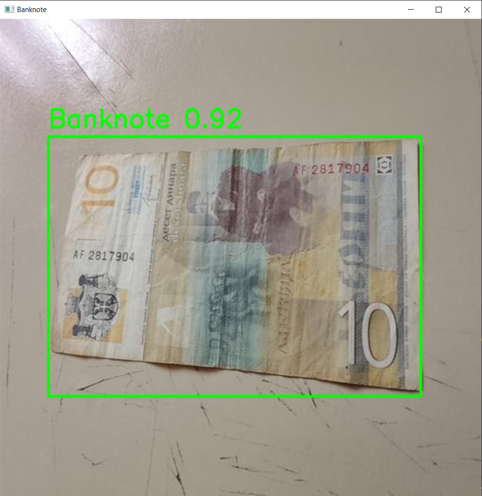
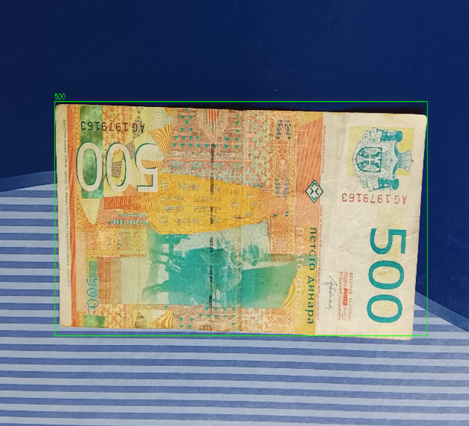

# SerbianBanknoteRecognition

A project for **detecting Serbian banknotes** using [YOLOv8](https://docs.ultralytics.com/).  
This repository contains scripts, configurations, and a dataset for training and testing a custom YOLOv8 object detection model.

## Project Structure

```bash
SerbianBanknoteRecognition/
├── configs/
│ │── cnn_config.json
│ └── data.yaml
├── data/
│ ├── raw/
│ │ ├── images/
│ │ └── labels/
│ └── processed/
│ ├── images/
│ ├── test/
│ │ ├── images/
│ │ └── labels/
│ ├── train/
│ │ ├── images/
│ │ └── labels/
│ └── val/
│ ├── images/
│ └── labels/
├── src/
│ │ └── cnn/
│ │ │ ├── cnn_model.py
│ │ │ ├── cnn_sort_dataset.py
│ │ │ ├── cnn_split_dataset.py
│ │ │ ├── cnn_test.py
│ │ │ └── cnn_train.py
│ │ └── yolo/
│ │ │ ├── yolo_crop_images.py
│ │ │ ├── yolo_preprocess.py
│ │ │ ├── yolo_rename_labels.py
│ │ │ └── yolo_split_dataset.py
│ │ │ ├── yolo_test_bb.py
│ │ │ ├── yolo_test.py
│ │ │ └── yolo_train.py
| ├── main.py
├── README.md
├── requirements.txt
└── yolo8n.pt
```

## How to Run

1. Clone the repo:

```bash
   git clone https://github.com/SStjepic/SerbianBanknoteRecognition
   cd SerbianBanknoteRecognition
```

2. Create a virtual environment

```bash
    python -m venv venv
    # Linux/Mac:
    source venv/bin/activate
    # Windows:
    venv\Scripts\activate
```

3. Install dependencies

```bash
    pip install -r requirements.txt
```

## Dataset

**Kaggle URL:** [Serbian Banknotes](https://www.kaggle.com/datasets/stefanstjepic/serbian-banknotes)

Download the Serbian Banknote dataset and extract files and place them into root folder.

### Dataset contents

- **270 .jpg images**: 30 images for each currently circulating Serbian banknote
- **270 .txt files**: bounding box coordinates for each banknote image - YOLO format _class x_center y_center width height_

## Preprocessing & Dataset Preparation

1. Preprocess the dataset

   Run script to resize images to 512x512

```bash
    python src/yolo/yolo_preprocess.py
```

2. Rename labels (optional)

   Labels should be in format '10RSD_front_01.txt'

```bash
    python src/yolo/yolo_rename_labels.py
```

3. Split the dataset into train/val/test

   Run this script to split dataset into train/val/test 70/15/15

```bash
    python src/yolo/yolo_split_dataset.py
```

## YOLOv8

YOLO only detects the presence of a banknote in an image. YOLO does not distinguish denominations, that is handled by the CNN.



### Config

_configs/data.yaml_

```bash
    nc: 1

    names: ["banknote"]

    train: ../data/processed/train/images
    val: ../data/processed/val/images
    test: ../data/processed/test/images
```

### Training

To start training run this command

```bash
    python src/yolo/yolo_train.py
```

Results will be saved in runs/ folder.

### Testing

Run this script to get YOLOv8 model metrics:

```bash
    python src/yolo/yolo_test.py
```

Run this script to test YOLOv8 model with bounding box visualization

```bash
    python src/yolo/yolo_test_bb.py
```

## CNN -> SerbianBanknoteCNN

CNN classifies cropped images based on their denomination.



My SerbianBanknoteCNN model:  
[Download from Google Drive](https://drive.google.com/file/d/1x5YHipBWls0bkoTCM87uhDsz-ocSAHyc/view?usp=sharing)

### Config

_configs/cnn_config.json_

```bash
{
  "data": {
    "train_dir": "./data/processed/cnn/train",
    "val_dir": "./data/processed/cnn/val",
    "test_dir": "./data/processed/cnn/test"
  },
  "model": {
    "save_dir": "cnn_model",
    "weights_file": "serbian_banknote_cnn.pth",
    "img_size": 256
  },
  "classes": ["10", "20", "50", "100", "200", "500", "1000", "2000", "5000"],
  "training": {
    "batch_size": 32,
    "lr": 0.001,
    "num_epochs": 50
  }
}
```

### Preprocessing & Dataset Preparation

When YOLOv8 model is trained, use it to crop all images and then sort and split them to get ready dataset for training

```bash
python src/yolo_crop_images.py
python src/cnn_sort_dataset.py
python src/cnn_split_dataset.py
```

### Training

When dataset is ready, you can start training CNN model

```bash
    python src/cnn/cnn_train.py
```

Results will be saved in _cnn_model_ folder.

### Testing

When training is completed it's time to test it

```bash
    python src/cnn/cnn_test.py
```

If you want to test the complete workflow YOLOv8 + CNN workflow you can run following command to see results

```bash
    python src/main.py

    # output example
    Enter the absolute path to the image ('exit'): ..\data\raw\images\500RSD_back_06.jpg

    0: 384x512 1 banknote, 75.8ms
    Speed: 25.5ms preprocess, 75.8ms inference, 1.2ms postprocess per image at shape (1, 3, 384, 512)
    tensor([5])
    Banknote:500
```
